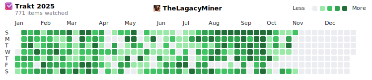
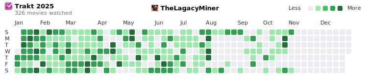
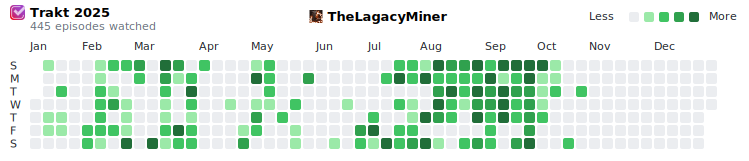

# Trakt Contribution Graph

[](https://github.com/nichtlegacy/trakt-graph/actions/workflows/update-trakt-graph.yml)
[](https://github.com/nichtlegacy/trakt-graph/releases/latest)


Generates a GitHub-style contribution graph from your Trakt watch history.

<p align="left">
  <a href="https://trakt.tv/users/TheLagacyMiner/" target="_blank">
    <picture>
      <source
        media="(prefers-color-scheme: dark)"
        srcset="https://github.com/nichtlegacy/trakt-graph/blob/main/images/github-trakt-dark.svg"
      />
      <source
        media="(prefers-color-scheme: light)"
        srcset="https://github.com/nichtlegacy/trakt-graph/blob/main/images/github-trakt-light.svg"
      />
      
    </picture>
  </a>
</p>

Turn your Trakt watch history (movies and TV shows) into a visually appealing heatmap, styled like GitHub's contribution graph. Display your viewing habits in your GitHub profile README or share them anywhere with light and dark theme SVGs!

## Features

- Fetches your Trakt watch history via the Trakt API.
- Generates SVG graphs in both light and dark themes for:
  - Movies only
  - Shows only
  - All watch history combined
- Includes your Trakt profile image and the Trakt logo.
- Supports customization: choose a specific year, set the week start (Sunday/Monday), and select content types.
- Interactive tooltips: Hover over a cell to see details of what was watched on that day (viewable in a browser).

## Usage

### GitHub Action

Automate graph generation using GitHub Actions.

```yaml
name: Update Trakt Contribution Graph
on:
  schedule:
    - cron: "0 0 * * *" # Runs daily at midnight UTC
  workflow_dispatch: # Allows manual triggering
permissions:
  contents: write
jobs:
  update-trakt-graph:
    runs-on: ubuntu-latest
    steps:
      - uses: actions/checkout@v4
      - uses: actions/setup-node@v4
        with:
          node-version: '20'
          cache: 'npm'
      - run: npm ci
      - run: npm start -u YOUR_TRAKT_USERNAME -a
        env:
          TRAKT_API_KEY: ${{ secrets.TRAKT_API_KEY }}
      - run: |
          git config --global user.name 'github-actions[bot]'
          git config --global user.email 'github-actions[bot]@users.noreply.github.com'
          git add images/github-trakt-*.svg
          git commit --allow-empty -m "🔄 Update Trakt contribution graph"
          git push
```

#### Setup Steps

1. **Fork This Repository**:
   - Click "Fork" to create a copy under your GitHub account.

2. **Set Up Environment Variables**:
   - Go to your repository's "Settings" > "Secrets and variables" > "Actions" > "Secrets".
   - Add `TRAKT_API_KEY` with your Trakt API key (see [Obtaining a Trakt API Key](#obtaining-a-trakt-api-key)).

3. **Update the Username**:
   - Open `.github/workflows/update-trakt-graph.yml`.
   - Replace `YOUR_TRAKT_USERNAME` with your Trakt username:
     ```yaml
     run: npm start -u YOUR_TRAKT_USERNAME
     ```

4. **Enable GitHub Actions**:
   - Go to the "Actions" tab and enable workflows if prompted.

5. **Customize (Optional)**:
   - Add flags to the `npm start` command:
     - `-y YEAR`: Specify a year (e.g., `-y 2024`).
     - `-w monday`: Start weeks on Monday (default: `sunday`).
     - `-m`: Filter to movies only.
     - `-s`: Filter to shows only.
     - `-a`: Generate all types (`movies`, `shows`, and `all`) at once.
     Example:
     ```yaml
     run: npm start -u YOUR_TRAKT_USERNAME -y 2024 -a
     ```

6. **Update the README**:
   - Replace placeholders in the `<picture>` tag with your GitHub and Trakt usernames:
     ```html
     <p align="left">
       <a href="https://trakt.tv/users/YOUR_TRAKT_USERNAME/" target="_blank">
         <picture>
           <source
             media="(prefers-color-scheme: dark)"
             srcset="https://github.com/YOUR_USERNAME/trakt-graph/blob/main/images/github-trakt-dark.svg"
           />
           <source
             media="(prefers-color-scheme: light)"
             srcset="https://github.com/YOUR_USERNAME/trakt-graph/blob/main/images/github-trakt-light.svg"
           />
           
         </picture>
       </a>
     </p>
     ```

7. **Run the Action**:
   - Wait for the daily run or trigger it manually via the "Actions" tab.

### Local Usage

Generate the graph locally:

```bash
# Clone the repo
git clone https://github.com/nichtlegacy/trakt-graph.git
cd trakt-graph

# Install dependencies
npm install

# Generate the graph
npm start -u YOUR_TRAKT_USERNAME
```

The SVGs will be saved to the `images/` directory. Add optional flags like `-y 2024` or `-w monday`.

## Prerequisites

- A public Trakt profile with watch history.
- A Trakt API key (see below).
- Node.js v18+ (for local use).
- GitHub account with Actions enabled (for automation).

## Obtaining a Trakt API Key

To use this project, you’ll need a Trakt API key (Client ID) from Trakt.tv. Follow these steps to obtain one:

1. Sign in to [Trakt.tv](https://trakt.tv).
2. Go to [Settings > API > New Application](https://trakt.tv/oauth/applications/new).
3. Fill out the application form:
   - **Name**: "Trakt Contribution Graph" (or any name you prefer).
   - **Icon**: Leave unselected (no icon required).
     - *Note*: If you choose to upload one, use a transparent PNG, square, and at least 256x256 pixels.
   - **Description**: Optional (e.g., "Generates a contribution graph from Trakt watch history"). This appears in the Connected Apps section when users grant access.
   - **Redirect URI**: Enter `urn:ietf:wg:oauth:2.0:oob` (for Device authentication, as no redirect is needed for this script).
     - Enter this exactly as shown, one URI per line, without query strings.
   - **Javascript (CORS) Origins**: Leave blank (not required for this project).
   - **Permissions**: Check both:
     - `/checkin`
     - `/scrobble`
     - *Note*: These permissions are selected for completeness, though this script only requires read access to your history.
4. Click "Save" to create the application.
5. Copy the **Client ID** from the application details page — this is your `TRAKT_API_KEY`.
6. For local use, add it to a `.env` file in the project root:
   ```
   TRAKT_API_KEY=your-client-id-here
   ```
7. For GitHub Actions, add it as a repository secret:
   - Go to "Settings" > "Secrets and variables" > "Actions" > "Secrets".
   - Add a new secret named `TRAKT_API_KEY` with the Client ID as the value (see [Setup Steps](#setup-steps)).

## Project Structure

```
trakt-graph/
├── images/              # Output directory for generated SVGs
├── .github/            # GitHub Actions workflows
│   └── workflows/
│       └── update-trakt-graph.yml
├── standalone.js            # Main script
├── package.json        # Dependencies and scripts
├── package-lock.json   # Dependency lock file
└── README.md           # This file
```

- **`standalone.js`**: Core logic for fetching Trakt data, processing it, and generating SVGs.
- **`images/`**: Default output directory for `github-trakt-dark.svg` and `github-trakt-light.svg`.

## API Routes

The script uses the following Trakt API endpoints:
- **`GET /users/{username}?extended=full`**: Fetches user profile data (display name, avatar).
- **`GET /users/{username}/history`**: Retrieves all watch history (paginated).
- **`GET /users/{username}/history/movies`**: Retrieves movie watch history.
- **`GET /users/{username}/history/shows`**: Retrieves show watch history.

Requests are authenticated with the `TRAKT_API_KEY` via the `trakt-api-key` header.

## Logging

The script includes console logs for debugging and monitoring:
- **Profile Fetch Errors**: Warns if profile data fetch fails, using fallback values.
- **Image Conversion Errors**: Warns if Base64 conversion fails (e.g., for avatars or logos).
- **History Fetch**: Logs page-by-page progress (e.g., "Fetched page 1: 100 items").
- **History Processing**: Logs the selected year, year-wise counts, total items, and day count stats.
- **Output Confirmation**: Confirms SVG file generation.

These logs are useful for troubleshooting API issues or verifying data processing.

## Screenshots

Below are example outputs with automatic light/dark switching:

### All (Default View)
<p align="left">
  <a href="https://trakt.tv/users/TheLagacyMiner" target="_blank">
    <picture>
      <source
        media="(prefers-color-scheme: dark)"
        srcset="images/github-trakt-dark.svg"
      />
      <source
        media="(prefers-color-scheme: light)"
        srcset="images/github-trakt-light.svg"
      />
      
    </picture>
  </a>
</p>

### Movies Only
<p align="left">
  <a href="https://trakt.tv/users/TheLagacyMiner" target="_blank">
    <picture>
      <source
        media="(prefers-color-scheme: dark)"
        srcset="images/github-trakt-movies-dark.svg"
      />
      <source
        media="(prefers-color-scheme: light)"
        srcset="images/github-trakt-movies-light.svg"
      />
      
    </picture>
  </a>
</p>

### Shows Only
<p align="left">
  <a href="https://trakt.tv/users/TheLagacyMiner" target="_blank">
    <picture>
      <source
        media="(prefers-color-scheme: dark)"
        srcset="images/github-trakt-shows-dark.svg"
      />
      <source
        media="(prefers-color-scheme: light)"
        srcset="images/github-trakt-shows-light.svg"
      />
      
    </picture>
  </a>
</p>

## Contributing

Have ideas or improvements? Open an issue or submit a pull request! Contributions are welcome.

## License

MIT License - see [LICENSE](LICENSE) for details.
